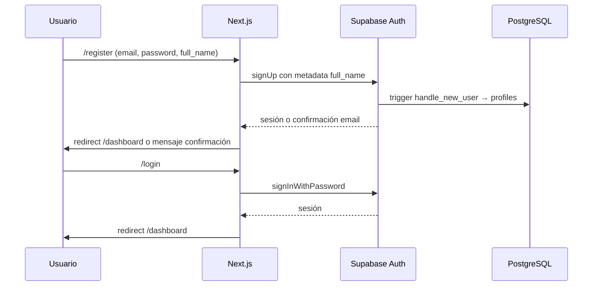
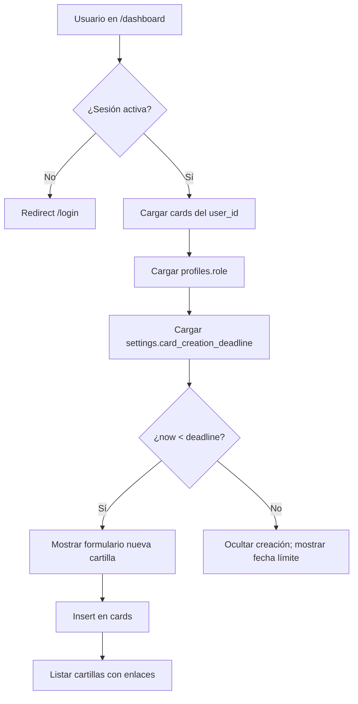
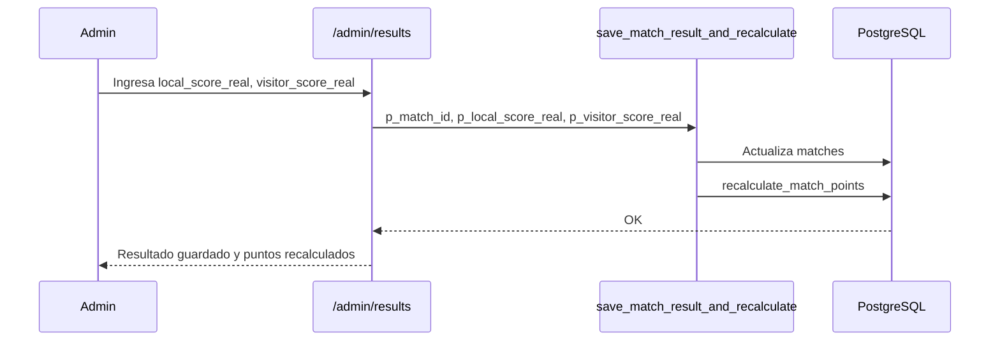
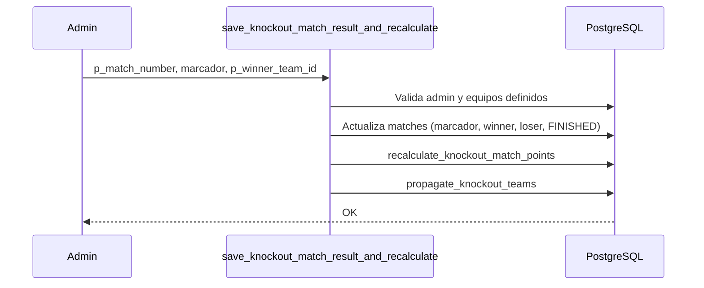
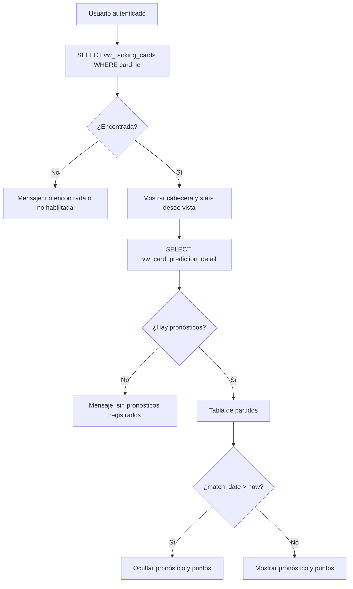
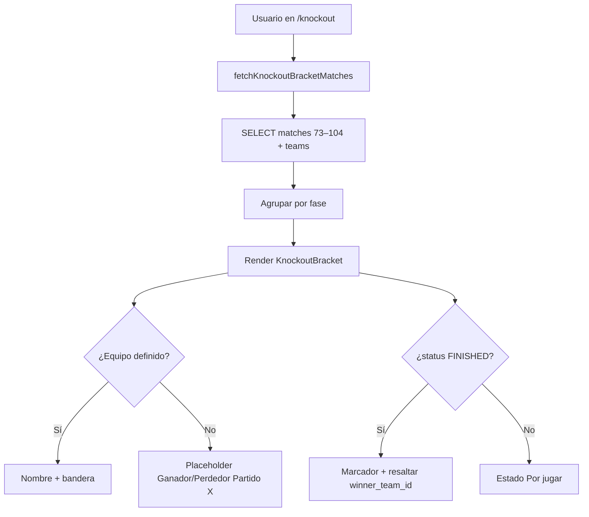
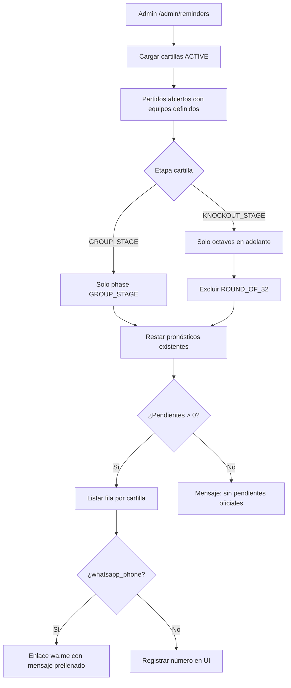

# 03 — Flujos funcionales

Descripción de flujos por actor y ruta. Refleja el comportamiento **implementado** en la aplicación.

---

## Mapa de rutas

| Ruta | Actor | Descripción |
|------|-------|-------------|
| `/` | Público | Landing con enlaces a ranking, login y registro |
| `/register` | Público | Alta de usuario |
| `/login` | Público | Inicio de sesión |
| `/dashboard` | Autenticado | Cartillas del usuario |
| `/cards/[id]` | Autenticado (dueño) | Pronósticos de una cartilla |
| `/cards/[id]/summary` | Autenticado (dueño) | Resumen detallado propio |
| `/ranking` | Público / autenticado | Ranking y podio (pestañas: fase de grupos y llaves) |
| `/cards-public/[id]` | Autenticado | Vista pública de cartilla ajena |
| `/admin/cards` | Admin | Gestión de cartillas |
| `/admin/results` | Admin | Carga de resultados |
| `/admin/settings` | Admin | Configuración global |
| `/knockout` | Público | Cuadro gráfico de llaves reales (partidos 73–104) |
| `/knockout-preview` | Público | Proyección referencial de grupos (sin menú; fuera de navegación principal) |

### Etapa eliminatoria (Fases 4–7 implementadas en repo)

| Ruta / flujo | Actor | Descripción | Estado |
|--------------|-------|-------------|--------|
| `/ranking` (pestaña Llaves) | Público | Ranking cartillas `KNOCKOUT_STAGE` vía `vw_ranking_cards_knockout` | ✅ |
| Cartilla `KNOCKOUT_STAGE` | Autenticado | Cartilla nueva separada; marcador + equipo clasificado | ✅ |
| `/cards/[id]/summary` (llaves) | Autenticado (dueño) | Resumen de pronósticos eliminatoria | ✅ |
| Admin resultados llaves | Admin | RPC `save_knockout_match_result_and_recalculate` | ✅ |
| `/knockout` | Público | Cuadro de llaves real desde `matches` (73–104) | ✅ |

**Sin cambios en lógica de grupos:** ranking de fase de grupos intacto en pestaña dedicada; pronósticos y RPC de grupos sin modificar.

---

## Flujo 1 — Registro e inicio de sesión



**Archivos:** `app/register/page.tsx`, `app/login/page.tsx`

**Reglas:**

- No insertar manualmente en `profiles` desde el registro.
- Protección de rutas privadas: verificación client-side con `getSession()` (sin middleware centralizado aún).

---

## Flujo 2 — Dashboard y creación de cartillas



**Archivos:** `app/dashboard/page.tsx`, `components/CardForm.tsx`, `components/CardList.tsx`

**Acciones desde cartilla:**

- Ver pronósticos → `/cards/[id]`
- Ver resumen → `/cards/[id]/summary`
- Enlaces admin si `role === 'admin'`

---

## Flujo 3 — Pronósticos por partido

```mermaid
flowchart TD
  A[/cards/id] --> B[Verificar sesión y ownership de cartilla]
  B --> C[Cargar matches + teams]
  C --> D[Cargar predictions de la cartilla]
  D --> E[Mostrar fixture con filtros]
  E --> F{¿match_date <= now?}
  F -->|No| G[Formulario editable]
  F -->|Sí| H[Solo lectura - Pronóstico cerrado]
  G --> I[upsert predictions]
  I --> J[points = 0 hasta resultado admin]
```

**Archivos:** `app/cards/[id]/page.tsx`, `components/MatchPredictionRow.tsx`, `lib/matches.ts`, `lib/matchPrediction.ts`

**UI:**

- Vista por grupo o por fecha (acordeones).
- Filtros: todos, pendientes, pronosticados, cerrados.
- Banderas vía `teams.flag_url`.

---

## Flujo 4 — Carga de resultados (admin)



**Archivos:** `app/admin/results/page.tsx`, `components/AdminMatchResultRow.tsx`

**Reglas:**

- Solo `profiles.role = 'admin'`.
- No recalcular puntos en el cliente.

---

## Flujo 4b — Carga de resultados eliminatoria (admin — backend, sin pantalla)



**Estado:** RPC, funciones y pantalla admin en `/admin/results` (pestaña Llaves).

**Reglas:**

- Solo `profiles.role = 'admin'`.
- Partido debe tener `local_team_id` y `visitor_team_id` definidos.
- `p_winner_team_id` debe ser uno de los dos equipos del partido.
- Propaga ganador/perdedor a partidos plantilla (`local_source_*` / `visitor_source_*`).

---

## Flujo 5 — Ranking general

```mermaid
flowchart LR
  A[/ranking] --> B{Pestaña activa}
  B -->|Grupos| C[SELECT vw_ranking_cards]
  B -->|Llaves| D[SELECT vw_ranking_cards_knockout]
  C --> E[Ordenar por puntos totales y calcular ranking denso]
  D --> E
  E --> F[Podio puestos 1–3 con empates]
  E --> G[Tabla completa]
  G --> H[Ver detalle → /cards-public/card_id]
```

**Archivos:** `app/ranking/page.tsx`, `components/RankingPodium.tsx`, `components/RankingTable.tsx`, `components/RankingSummaryCards.tsx`, `lib/ranking.ts`

**Reglas:**

- Solo cartillas `ACTIVE` (las vistas ya las filtran).
- Cartillas `INACTIVE` no aparecen.
- Pestaña «Fase de grupos»: `vw_ranking_cards` (sin cambios).
- Pestaña «Llaves»: `vw_ranking_cards_knockout`; solo octavos en adelante; `exact_scores` = aciertos de marcador exacto (3 o 5 pts); `result_hits` = aciertos de clasificado (2 o 5 pts); sin enlace a vista pública (solo grupos).
- Orden oficial: `total_points` desc; empates comparten posición; ranking denso (1, 1, 2, 2, 3) vía `calculateDenseRankingPositions` en `lib/ranking.ts`.
- Texto UI: «El ranking se ordena por puntos totales. En caso de empate, las cartillas comparten la misma posición.» + «La numeración de puestos usa ranking denso: 1, 1, 2, 2, 3.»

---

## Flujo 6 — Resumen propio de cartilla

**Ruta:** `/cards/[id]/summary`

1. Usuario autenticado.
2. Verificar que la cartilla pertenece al usuario (`cards` + `user_id`).
3. Según `cards.stage`:
   - **`GROUP_STAGE`:** cargar `vw_card_prediction_detail` filtrado por `card_id` (comportamiento original).
   - **`KNOCKOUT_STAGE`:** cargar `predictions` + partidos eliminatoria (`matches` con equipos); mostrar marcador, clasificado pronosticado/real y placeholders de plantilla.
4. Mostrar estadísticas y tabla con todos los pronósticos (incluidos futuros, porque es el dueño).

**Archivos:** `app/cards/[id]/summary/page.tsx`, `components/CardSummaryStats.tsx`, `components/CardSummaryTable.tsx`, `components/KnockoutCardSummaryTable.tsx`, `lib/cardSummary.ts`, `lib/knockoutCardSummary.ts`

---

## Flujo 7 — Vista pública de cartilla ajena

**Ruta:** `/cards-public/[id]`



**Archivos:** `app/cards-public/[id]/page.tsx`, `components/PublicCardSummaryStats.tsx`, `components/PublicCardSummaryTable.tsx`

**Reglas críticas:**

- **No** consultar `cards` ni `profiles` para datos ajenos.
- Fuente principal: `vw_ranking_cards` + `vw_card_prediction_detail`.
- Solo lectura; sin edición.

---

## Flujo 8 — Administración de cartillas

**Ruta:** `/admin/cards`

1. Verificar rol admin.
2. Listar todas las cartillas (`cards` con RLS admin).
3. Filtrar por estado y búsqueda.
4. Cambiar estado vía `admin_update_card_status` (`ACTIVE` / `INACTIVE`).

---

## Flujo 9 — Configuración global

**Ruta:** `/admin/settings`

1. Verificar rol admin.
2. Leer `settings` donde `key = 'card_creation_deadline'`.
3. Admin edita fecha/hora en UI (zona Perú).
4. Guardar vía `admin_update_setting` (no update directo por RLS).

**Archivos:** `app/admin/settings/page.tsx`, `lib/settingsDeadline.ts`

---

## Flujo 10 — Cuadro de llaves (eliminatoria real)

**Ruta:** `/knockout`



**Archivos:** `app/knockout/page.tsx`, `components/KnockoutBracket.tsx`, `lib/knockoutMatches.ts`

**Reglas:**

- Solo lectura; sin pronósticos ni edición.
- Fuente: `public.matches` con `match_number` entre 73 y 104.
- Placeholders según `local_source_*` / `visitor_source_*` (`WINNER` / `LOSER`).
- Equipos propagados por admin aparecen cuando `local_team_id` / `visitor_team_id` están definidos.
- Navegación principal: enlace «Llaves» en `Navbar` (ya no «Llaves probables»).
- `/knockout-preview` permanece como proyección referencial de fase de grupos, **fuera del menú**.

---

## Flujo 11 — Recordatorios WhatsApp (admin, manual)



**Archivos:** `app/admin/reminders/page.tsx`, `lib/adminReminders.ts`, `lib/whatsappReminder.ts`

**Reglas:**

- Solo admin (`profiles.role = 'admin'`).
- **No** hay envío automático ni API de WhatsApp; el botón abre `https://wa.me/{phone}?text=...` en nueva pestaña.
- Pendientes oficiales: partido no iniciado, equipos definidos, sin pronóstico en la cartilla.
- Llaves: solo `ROUND_OF_16` … `FINAL`; `ROUND_OF_32` excluido.
- Cartillas `INACTIVE` no se listan.
- Perfil: `profiles.whatsapp_phone` (formato internacional sin `+`), `whatsapp_enabled` (default `true`).
- Migración: `005_profiles_whatsapp_fields.sql`.

---

## Componentes y librerías compartidas

| Módulo | Responsabilidad |
|--------|-----------------|
| `lib/supabaseClient.ts` | Cliente Supabase |
| `lib/types.ts` | Tipos TypeScript alineados a BD |
| `lib/matchPrediction.ts` | Fechas Perú, cierre de pronósticos |
| `lib/matches.ts` | Carga de partidos `GROUP_STAGE` con equipos |
| `lib/knockoutMatches.ts` | Partidos eliminatoria, placeholders, cuadro 73–104 |
| `lib/cardSummary.ts` | Etiquetas y stats de resumen |
| `lib/settingsDeadline.ts` | Parse/build deadline Perú |
| `lib/ranking.ts` | Orden por puntos, ranking denso y fetch por etapa (grupos y llaves) |
| `lib/adminReminders.ts` | Pendientes oficiales para recordatorios admin |
| `lib/whatsappReminder.ts` | Mensaje prellenado y URL wa.me |
| `lib/knockoutCardSummary.ts` | Stats y filas de resumen eliminatoria |
| `supabase/migrations/` | Migraciones SQL (Fases 1–3 etapa eliminatoria) |
| `components/Navbar.tsx` | Navegación global |
| `components/TeamFlag.tsx` | Banderas |
