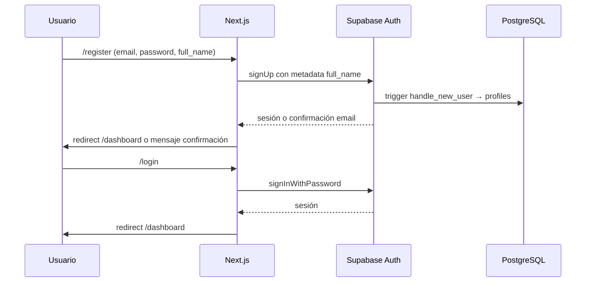
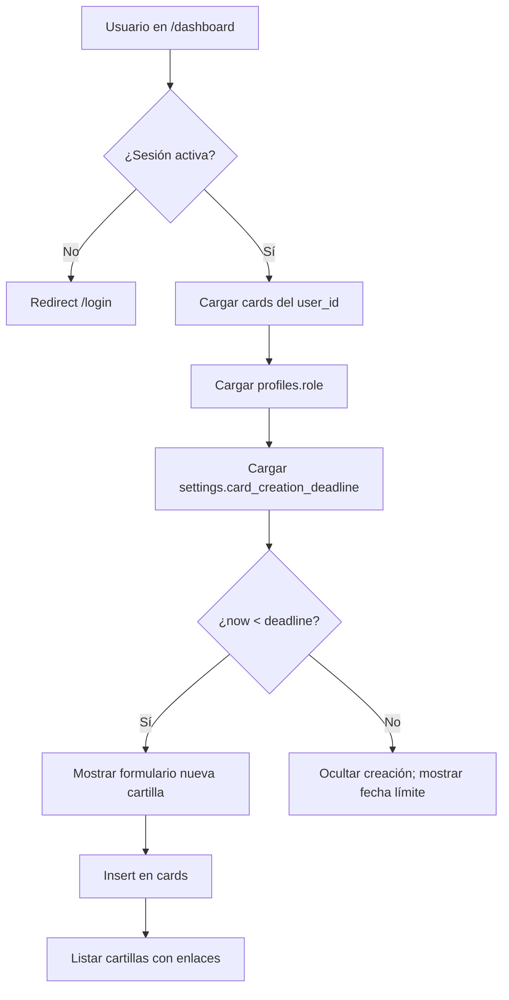
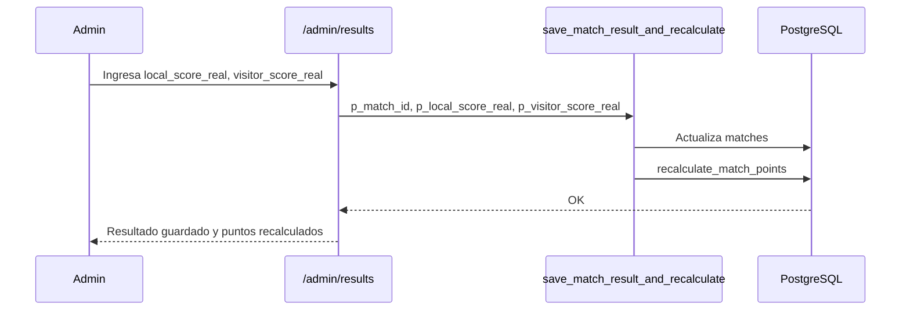
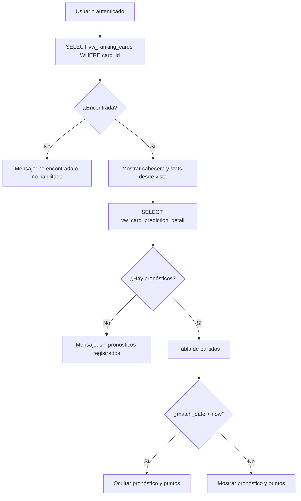

# 03 — Flujos funcionales

Descripción de flujos por actor y ruta. Refleja el comportamiento **implementado** en la aplicación.

---

## Mapa de rutas

| Ruta | Actor | Descripción |
|------|-------|-------------|
| `/` | Público | Landing con enlaces a ranking, login y registro |
| `/register` | Público | Alta de usuario |
| `/login` | Público | Inicio de sesión |
| `/dashboard` | Autenticado | Cartillas del usuario |
| `/cards/[id]` | Autenticado (dueño) | Pronósticos de una cartilla |
| `/cards/[id]/summary` | Autenticado (dueño) | Resumen detallado propio |
| `/ranking` | Público / autenticado | Ranking y podio |
| `/cards-public/[id]` | Autenticado | Vista pública de cartilla ajena |
| `/admin/cards` | Admin | Gestión de cartillas |
| `/admin/results` | Admin | Carga de resultados |
| `/admin/settings` | Admin | Configuración global |
| `/knockout-preview` | Público | Proyección informativa de grupos/llaves (sin pronósticos) |

### Etapa eliminatoria (planificado — Fase 1 solo esquema BD)

| Ruta / flujo futuro | Actor | Descripción |
|---------------------|-------|-------------|
| `/ranking/knockout` (propuesta) | Público | Ranking cartillas `KNOCKOUT_STAGE` |
| Cartilla `KNOCKOUT_STAGE` | Autenticado | Cartilla nueva separada; marcador + equipo clasificado |
| Admin resultados llaves | Admin | Marcador + `winner_team_id`; propagación |

**Sin cambios en Fase 1:** `/cards/[id]`, `/admin/results`, `/ranking` (fase de grupos intacta).

---

## Flujo 1 — Registro e inicio de sesión



**Archivos:** `app/register/page.tsx`, `app/login/page.tsx`

**Reglas:**

- No insertar manualmente en `profiles` desde el registro.
- Protección de rutas privadas: verificación client-side con `getSession()` (sin middleware centralizado aún).

---

## Flujo 2 — Dashboard y creación de cartillas



**Archivos:** `app/dashboard/page.tsx`, `components/CardForm.tsx`, `components/CardList.tsx`

**Acciones desde cartilla:**

- Ver pronósticos → `/cards/[id]`
- Ver resumen → `/cards/[id]/summary`
- Enlaces admin si `role === 'admin'`

---

## Flujo 3 — Pronósticos por partido

```mermaid
flowchart TD
  A[/cards/id] --> B[Verificar sesión y ownership de cartilla]
  B --> C[Cargar matches + teams]
  C --> D[Cargar predictions de la cartilla]
  D --> E[Mostrar fixture con filtros]
  E --> F{¿match_date <= now?}
  F -->|No| G[Formulario editable]
  F -->|Sí| H[Solo lectura - Pronóstico cerrado]
  G --> I[upsert predictions]
  I --> J[points = 0 hasta resultado admin]
```

**Archivos:** `app/cards/[id]/page.tsx`, `components/MatchPredictionRow.tsx`, `lib/matches.ts`, `lib/matchPrediction.ts`

**UI:**

- Vista por grupo o por fecha (acordeones).
- Filtros: todos, pendientes, pronosticados, cerrados.
- Banderas vía `teams.flag_url`.

---

## Flujo 4 — Carga de resultados (admin)



**Archivos:** `app/admin/results/page.tsx`, `components/AdminMatchResultRow.tsx`

**Reglas:**

- Solo `profiles.role = 'admin'`.
- No recalcular puntos en el cliente.

---

## Flujo 5 — Ranking general

```mermaid
flowchart LR
  A[/ranking] --> B[SELECT vw_ranking_cards]
  B --> C[Ordenar: puntos, exactos, aciertos, nombre cartilla]
  C --> D[Podio top 3]
  C --> E[Tabla completa]
  E --> F[Ver detalle → /cards-public/card_id]
```

**Archivos:** `app/ranking/page.tsx`, `components/RankingPodium.tsx`, `components/RankingTable.tsx`, `components/RankingSummaryCards.tsx`

**Reglas:**

- Solo cartillas `ACTIVE` (la vista ya las filtra).
- Cartillas `INACTIVE` no aparecen.
- Orden oficial: `total_points` desc, `exact_scores` desc, `result_hits` desc, `card_name` asc (helper `lib/ranking.ts`).

---

## Flujo 6 — Resumen propio de cartilla

**Ruta:** `/cards/[id]/summary`

1. Usuario autenticado.
2. Verificar que la cartilla pertenece al usuario (`cards` + `user_id`).
3. Cargar `vw_card_prediction_detail` filtrado por `card_id`.
4. Mostrar estadísticas y tabla con todos los pronósticos (incluidos futuros, porque es el dueño).

**Archivos:** `app/cards/[id]/summary/page.tsx`, `components/CardSummaryStats.tsx`, `components/CardSummaryTable.tsx`

---

## Flujo 7 — Vista pública de cartilla ajena

**Ruta:** `/cards-public/[id]`



**Archivos:** `app/cards-public/[id]/page.tsx`, `components/PublicCardSummaryStats.tsx`, `components/PublicCardSummaryTable.tsx`

**Reglas críticas:**

- **No** consultar `cards` ni `profiles` para datos ajenos.
- Fuente principal: `vw_ranking_cards` + `vw_card_prediction_detail`.
- Solo lectura; sin edición.

---

## Flujo 8 — Administración de cartillas

**Ruta:** `/admin/cards`

1. Verificar rol admin.
2. Listar todas las cartillas (`cards` con RLS admin).
3. Filtrar por estado y búsqueda.
4. Cambiar estado vía `admin_update_card_status` (`ACTIVE` / `INACTIVE`).

---

## Flujo 9 — Configuración global

**Ruta:** `/admin/settings`

1. Verificar rol admin.
2. Leer `settings` donde `key = 'card_creation_deadline'`.
3. Admin edita fecha/hora en UI (zona Perú).
4. Guardar vía `admin_update_setting` (no update directo por RLS).

**Archivos:** `app/admin/settings/page.tsx`, `lib/settingsDeadline.ts`

---

## Componentes y librerías compartidas

| Módulo | Responsabilidad |
|--------|-----------------|
| `lib/supabaseClient.ts` | Cliente Supabase |
| `lib/types.ts` | Tipos TypeScript alineados a BD |
| `lib/matchPrediction.ts` | Fechas Perú, cierre de pronósticos |
| `lib/matches.ts` | Carga de partidos con equipos |
| `lib/cardSummary.ts` | Etiquetas y stats de resumen |
| `lib/settingsDeadline.ts` | Parse/build deadline Perú |
| `lib/ranking.ts` | Orden oficial de `vw_ranking_cards` |
| `supabase/migrations/` | Migraciones SQL (Fase 1: esquema eliminatoria) |
| `components/Navbar.tsx` | Navegación global |
| `components/TeamFlag.tsx` | Banderas |
